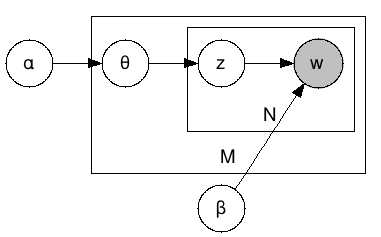
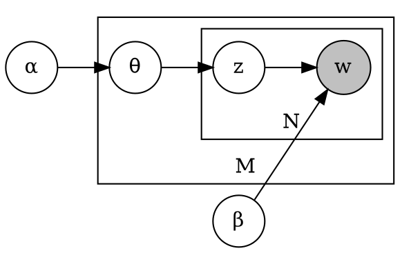

# LDA
Python 3 modified code of [PythonでLDAを実装してみる](http://satomacoto.blogspot.jp/2009/12/pythonlda.html)  
[Beli, Ng, and Jordan (2003)](http://www.jmlr.org/papers/volume3/blei03a/blei03a.pdf) Figure 1  
Useful derivation [note](http://chasen.org/~daiti-m/paper/lda-fullvb.pdf)

## 仕組み
[PythonでLDAを実装してみる](http://satomacoto.blogspot.jp/2009/12/pythonlda.html)から引用
> トピックzの数をk個、単語wの種類をV個とすると、パラメータαはk次元のベクトル、βはk x V次元の行列でβij=p(wj|zi)  
> ここで、ドキュメントにおけるαとβの値がわかれば、トピックがどんな割合であって（α）、そのトピックに関する語がどんな割合で存在するか（β）がわかる。つまり、ドキュメントが上のようなプロセスで生成されているとしてαとβの値はいくつかということを推定するのがLDAの目的。

