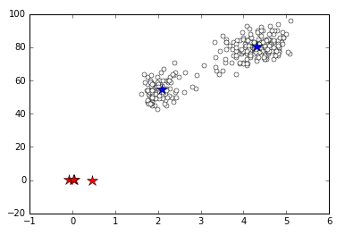

# Variational Bayes: Gaussian Mixture Model
References:
* PRML: 10.2
* PRML Math Book: p.93
* [Slides](http://www.slideshare.net/takao-y/ss-28872465)
* [Python Code Reference](http://d.hatena.ne.jp/chrofieyue/20111128/1322486240)
* [R Code Reference](http://d.hatena.ne.jp/n_shuyo/20100423/variational)
* [Another Math Help](http://www.cis.nagasaki-u.ac.jp/~masada/VBGMM.pdf)

## Python

## C++
**This may include bugs!!!**

Digamma Function can be found at [CODECOGS](http://www.codecogs.com/library/maths/special/gamma/psi.php)
* You need `psi.h` and `poly_eval.h`.
 
### Results
Iteration 10:  

 
Best output (not the one in `output` file):
```terminal
num: 272 / ndim: 2
Nk:
2.72e-08
2.72e-08
2.72e-08
     100
     172
2.72e-08

alpha:
3.67649e-06
3.67649e-06
3.67649e-06
   0.367643
   0.632343
3.67649e-06

mk:
9.48651e-05  0.00192835
9.48651e-05  0.00192835
9.48651e-05  0.00192835
    2.09431     54.7495
    4.29791     80.2844
9.48651e-05  0.00192835

r_nk.row(1):
1e-10 1e-10 1e-10     1 1e-10 1e-10
```
