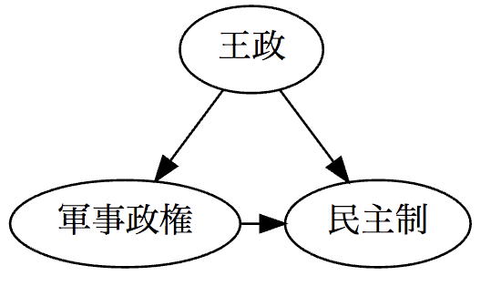

# graphviz
`from graphviz import Digraph`

## Table of Contents
1. [Template](#template)

## Template
```python
dot = Digraph(comment='The Round Table', format='pdf')

dot.node('A', '王政')
dot.node('B', '軍事政権')
dot.node('L', '民主制')

dot.edges(['AB', 'AL'])
dot.edge('B', 'L', constraint='false')  # constraint argumentがtrueで良いなら、上のedgesにまとめてOK

print(dot.source) # これを保存すればDOT言語のファイルが保存できるはず
dot.render('test-output/round-table.gv')
dot
```

