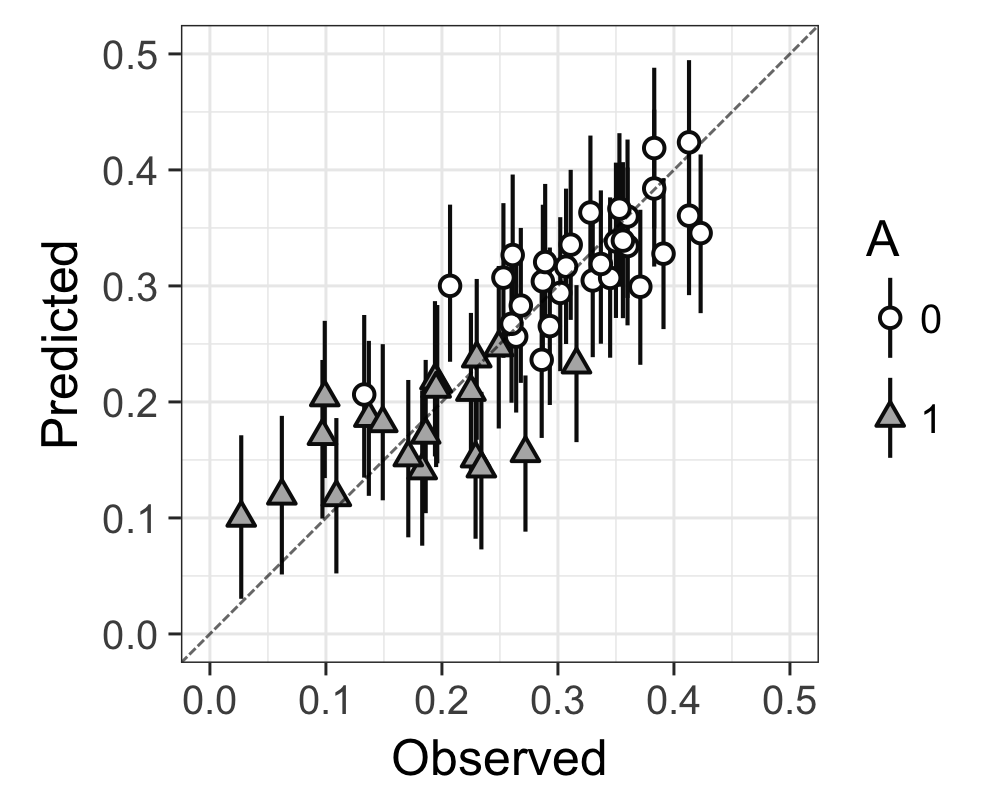
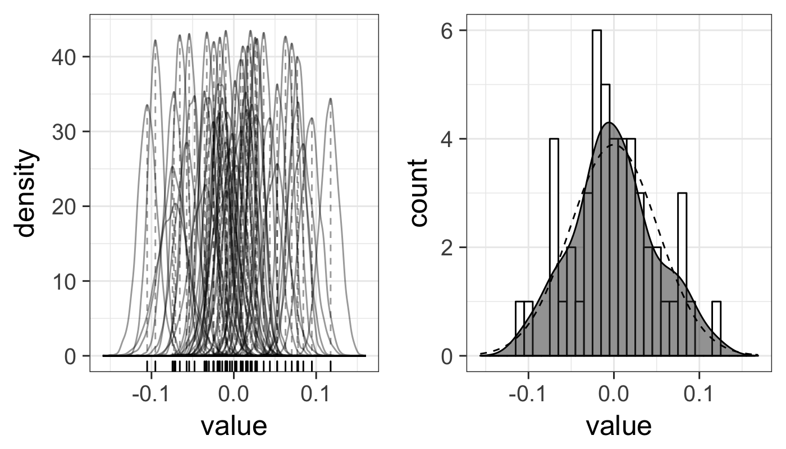

# Chapter 5

## Tips
### Scaling (p.30)
In model 5-3, score is divided by 200 to adjust the parameters scale to around 1. It can improve the model's convergence.   

There are several ways for scaling:
* divide by unit (万円なら10000で割る)
* divide by standard deviation
* divide by two times s.d.
* divide by maximum value

### Visualization of Multiple Regression
#### p.61 / model5-3
実測値と予測値のプロット / 推定されたノイズの分布

## Words
* extrapolation: 与えられたデータの範囲外を予測すること

## Pictures
### Multiple Regression Visualizations
#### Observed values and Predicted values
`modelres5-3_PredValues.png`: distribution of the each error term

`modelres5-3_DistError.png`:  
Choose MAP from the distribution of error term, and made its distribution.

