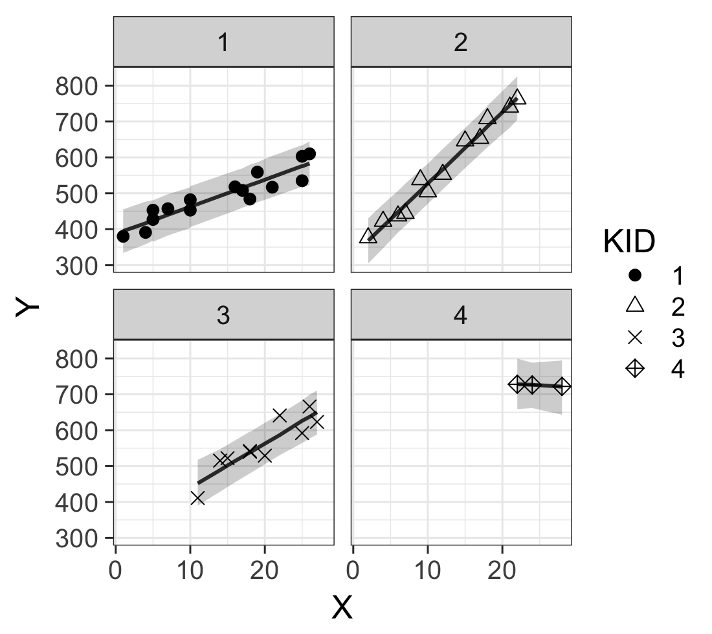
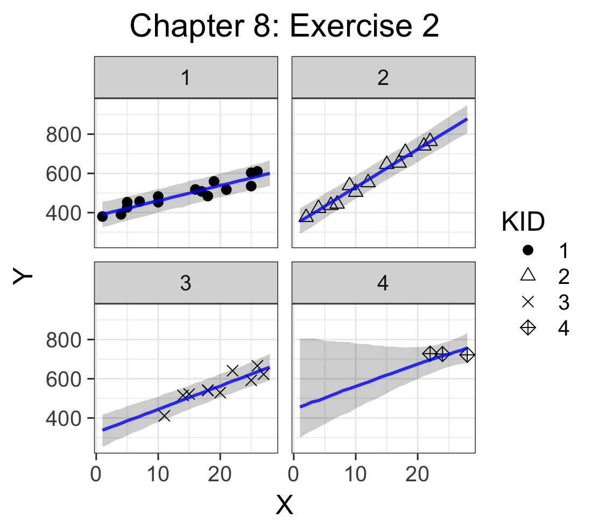
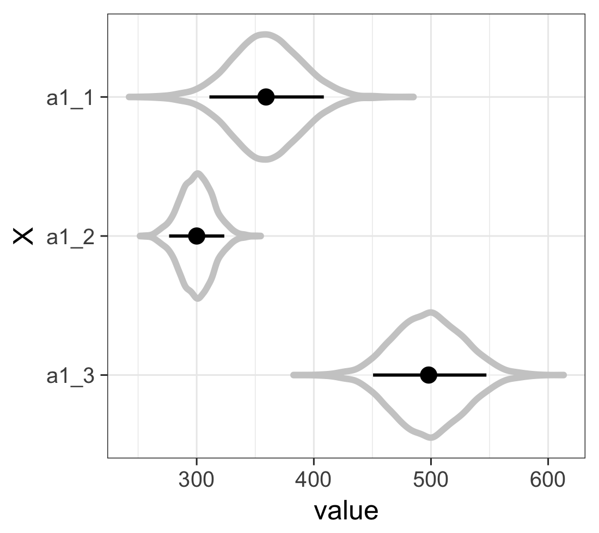
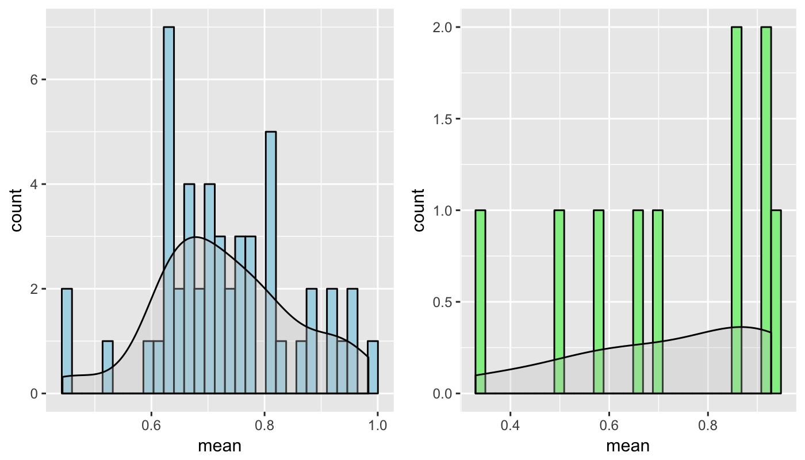

# Chapter 8

## 8.1 Introduction to the Hierarchical Model

### 8.1.2 Visualization of the Normal Regression

## 8.2 Hierarchical Models with Several Hierarchies
Figure in p.133: 
 
a (coefficient): category 3 has bigger average, smaller variance

## 8.4 Logistic Hierarchical Model

## Exercise
### (1)
The figure is different from the textbook's figure. I generated `y_pred` in the Stan code, but textbook generates predicted values after the estimation. This is why textbook can successfully generates values across X's range.  
My try:  

Textbook answer:

### (2)
 
Calculated expected values inside the Stan code, which is different from the textbook (I believe this is more computationally efficient).

### (3)
 

### (4)
 
