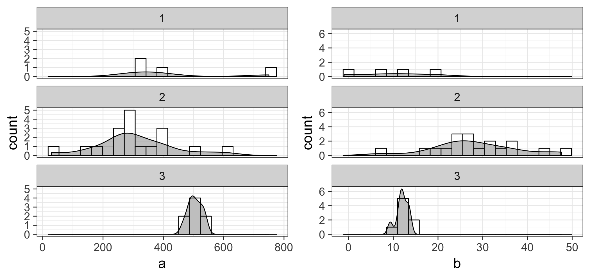
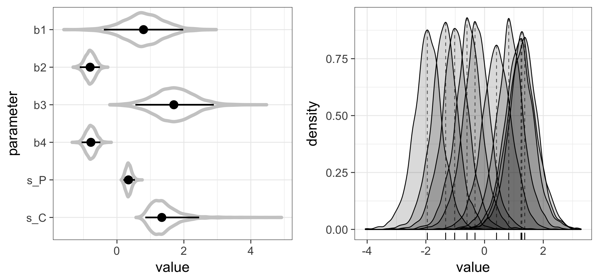

# Chapter 8

## 8.1 Introduction to the Hierarchical Model
`sec8.1.R`

### 8.1.2 Visualization of the Normal Regression

## 8.2 Hierarchical Models with Several Hierarchies
Figure in p.133: 

a (coefficient): category 3 has bigger average, smaller variance

## 8.4 Logistic Hierarchical Model

