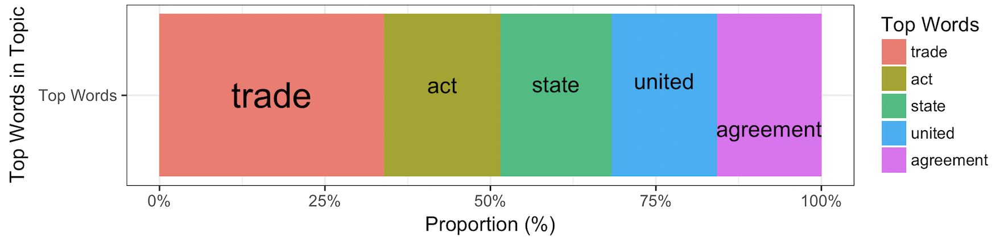
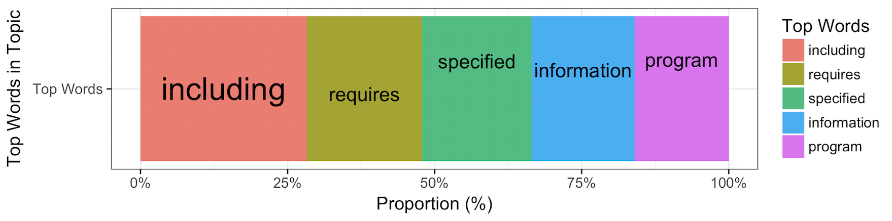

# Stack Bar

## Data
```terminal
> glimpse(res)
Observations: 97,327
Variables: 6
$ Word         <chr> "passed", "house", "amended", "urge", "president", "se...
$ Topic        <chr> "R", "R", "R", "R", "R", "R", "R", "R", "R", "R", "R",...
$ TopicUsedNum <int> 596, 596, 596, 596, 596, 596, 596, 596, 596, 596, 596,...
$ Filename     <chr> "106_hconres190", "106_hconres190", "106_hconres190", ...
$ DocId        <int> 0, 0, 0, 0, 0, 0, 0, 0, 0, 0, 0, 0, 0, 0, 0, 0, 0, 0, ...
$ DocPosition  <int> 0, 1, 2, 3, 4, 5, 6, 7, 8, 9, 10, 11, 12, 13, 14, 15, ...

> glimpse(res_topic)
Observations: 109
Variables: 5
$ Word       <chr> "trade", "act", "state", "united", "agreement", "commodi...
$ Topic      <chr> "R", "R", "R", "R", "R", "R|00", "R|00", "R|00", "R|00",...
$ Count      <int> 2971, 1542, 1464, 1401, 1379, 16, 14, 13, 11, 10, 162, 1...
$ TopicCount <int> 81146, 81146, 81146, 81146, 81146, 414, 414, 414, 414, 4...
$ Proportion <dbl> 3.661302, 1.900279, 1.804155, 1.726518, 1.699406, 3.8647...

> glimpse(temp)
Observations: 5
Variables: 11
$ Word           <chr> "export", "africa", "african", "arrangement", "country"
$ Topic          <chr> "R|00|01", "R|00|01", "R|00|01", "R|00|01", "R|00|01"
$ Count          <int> 4, 3, 2, 2, 2
$ TopicCount     <int> 52, 52, 52, 52, 52
$ Proportion     <dbl> 7.692308, 5.769231, 3.846154, 3.846154, 3.846154
$ CountSum       <int> 13, 13, 13, 13, 13
$ Proportion_top <dbl> 30.76923, 23.07692, 15.38462, 15.38462, 15.38462
$ `Top Words`    <chr> "Top Words", "Top Words", "Top Words", "Top Words", ...
$ ranking        <int> 1, 2, 3, 4, 5
$ cumsum         <dbl> 30.76923, 53.84615, 69.23077, 84.61538, 100.00000
$ pos            <dbl> 15.38462, 42.30769, 61.53846, 76.92308, 92.30769
```

## Code
```r
topn <- 5

res %>%
  filter(Word != "sec") %>%
  group_by(Topic) %>%
  group_by(Word, Topic) %>%
  summarize(Count = n()) %>%
  ungroup() %>% group_by(Topic) %>%
  mutate(TopicCount = sum(Count)) %>%
  mutate(Proportion = Count / TopicCount * 100) %>%
  top_n(get("topn"), Proportion) %>%
  arrange(Topic, desc(Count)) -> res_topic

unique_topic <- unique(res$Topic)

for(topic in unique_topic){
  res_topic %>% filter(Topic == get("topic")) %>%
    head(get("topn")) %>%
    mutate(CountSum = sum(Count)) %>%
    mutate(Proportion_top = Count/CountSum * 100) %>%
    mutate(`Top Words`="Top Words",
           ranking = 1:n()) %>%
    ungroup() %>% 
    mutate(cumsum = cumsum(Proportion_top)) %>%
    mutate(pos = cumsum - 0.5*Proportion_top) -> temp


  num <- length(unique(temp$Word))
  cols       <- ggColorHue(n=num)
  cols_dark  <- ggColorHue(n=num, l=45)
  cols_light <- ggColorHue(n=num, l=85)
  col2rgb(cols)

  topwords <- ggplot(temp,
            aes(x=`Top Words`, 
                fill=factor(Word, levels=rev( reorder(Word, Proportion_top) ))
            ))+
      geom_bar(aes(y=Proportion_top), position = "fill",stat = "identity") +
      geom_text(aes(x = `Top Words`, y = pos/100,
                   label = ifelse((ranking<=3 & Proportion_top>20), Word, "")), 
                size=8.0) +
      geom_text(aes(x = `Top Words`, y = pos/100,
                   label = ifelse((ranking>3 | Proportion_top<=20), Word, "")), 
                size=5.0,
                position=position_jitter(width=0.2, height=0.0)) +
      coord_flip() +
      guides(fill = guide_legend(reverse = TRUE)) +
      scale_y_continuous(labels = scales::percent) +
      scale_fill_manual(name = "Top Words",
                        values=rev(cols)) +
    theme_bw(base_size=13) +
    xlab("Top Words in Topic") + ylab("Proportion (%)")

  print(topwords)
  readline(prompt="Press [enter] to continue")
}
```





