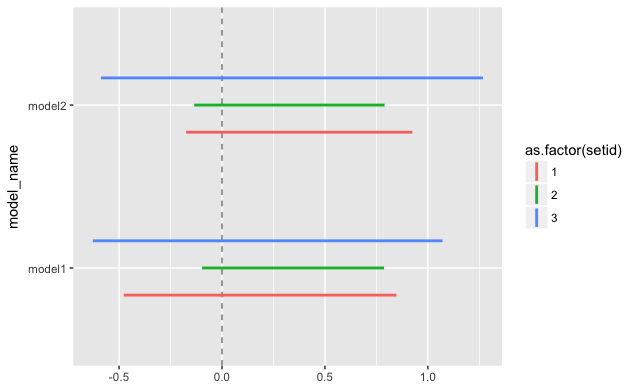

# dplyr

## Table of Contents
1. [処理をして列を追加](#処理をして列を追加)
2. [select](#select)
	* [文字で](#文字で)
	* [条件付き列選択](#条件付き列選択)
3. [列名変更](#列名変更)
4. [複数列へ同じ処理を行う](#複数列へ同じ処理を行う)
5. [apply的処理](#apply的処理)
6. [Regression Simulation](#regression-simulation)
7. [記述統計](#記述統計)
8. [Environmentの変数を使う](#environmentの変数を使う)
9. [時間関連](#時間関連)
10. [行のスライス](#行のスライス)
11. [NAの処理](#naの処理)
12. [Create Dummy](#create-dummy)
13. [Split words](#split-words)
14. [Copy rows](#copy-rows)
15. [tidyeval](#tidyeval)


## 処理をして列を追加
```r
data %>%  group_by(year)  %>% mutate(med_age = median(age, na.rm=TRUE)) -> data
```
You can `ungroup()` after grouping.

## select
### 文字で
```r
select_(.dots = c("educ",
	"A14:A29", "C_ach:C_pal", ~starts_with("G", ignore.case=F), # ACG
	"-G1_14_17", "-G1_26_30", "-G2_18_21", "-G2_26_30", "-G3_22_25","-G3_26_30",
	~starts_with("fthr_"), "-fthr_ed", "-fthr_edhi", # ctrls
	))
```

### 条件付き列選択
```r
temp <- data %>% 
    filter(age<31) %>%
    select_(.dots=c("id2", starts_with("hhii"), "abd_lgth_hh"))
```
なぜか上手く回らなかったので、こちらを: `temp[,grep('hhii|id2|abd_lgth_hh',names(temp))]` --> `.dots`とすればOK?

## 列名変更
```r
rename(data, NEW = OLD)
```

## 複数列へ同じ処理を行う
```r
> iris %>% mutate_each(funs(h = ./2), -Species) # Species以外の全ての値を半分に
> iris %>% group_by(Species) %>% summarise_each(funs(mean, sd)) # Speciesでグループ化して各列の平均と標準偏差
```

## apply的処理
```r
fun_AgeCohorts <- function(x){
	if(x==0) return("male")
	if(x==1) return("female") # if you return a number, make sure as.double() !!
}

population <- population %>% 
	rowwise() %>%
	mutate(gender_name=fun_AgeCohorts(gender))
```

```r
get_time <- function(x, type){
  print(x)
  time <- stringr::str_split(x, pattern=" ")[[1]][2]
  time <- stringr::str_split(time, pattern=":")[[1]]
  if(type=="hour")
    return(as.integer(time[1]))
  if(type=="minute")
    return(as.integer(time[2]))
}
data %>% select(datetime) %>% rowwise() %>%
  mutate(hour = get_time(datetime, "hour"), minute=get_time(datetime,"minute"))
```

直にapplyを使うこともできる
```r
calc_dist <- function(vec, target){
  distance <- dist(rbind(target, vec[3:12]))[1]
  return(distance)
}

wordvec %>%
  mutate(distance = apply(., 1, calc_dist, target=get("target"))) %>%
  arrange(distance)
```

## Regression Simulation
[Reference](http://ja.stackoverflow.com/q/32351/12704)  
ちなみに、下のコードでは`position_dodge`を負の値にすることで線分の並びを逆にすることができる。
```r
library(broom) # for tidy()
temp <- population %>%
  group_by(setid) %>%
  do(model1 = tidy(lm(score ~ age, data = .)),
     model2 = tidy(lm(score ~ age + gender, data = .))) %>%   ## Same as question
  gather(model_name, model, -setid) %>%  ## make it long format / gather(-setid, key=model_name, value=mode)??
  unnest() %>%  ## expand
  filter(term == "age") ## select a variable


  ## same as the website linked in the question (some parts are skipped)
interval1 <- -qnorm((1-0.9)/2)

ggplot(temp, aes(colour = as.factor(setid))) +
  geom_hline(yintercept = 0, colour = gray(1/2), lty = 2) +
  geom_linerange(aes(x = model_name, ymin = estimate - std.error*interval1,
                     ymax = estimate + std.error*interval1),
                 lwd = 1, position = position_dodge(width = 1/2)) +
  coord_flip()
```


## 記述統計
### Example 1
```r
sway %>% subset(found==1) %>% 
	select_("abd", "w_abs2", "abd_l", "abd_age", "exper", "viol_perp", "educ") %>%
	group_by(abd) %>%
	summarise_each(funs(mean = weighted.mean(., w=w_abs2, na.rm=T)), -matches("w_abs2")) %>%
	round(2) %>%
	select_("-abd") %>% 
	t %>%  # transpose
	`colnames<-`(c("NonAbducted", "Abducted")) %>% # or setNames()
	subset(select=c(2,1)) %>% # reorder columns
	`rownames<-`(c("Months abducted", "Age of abduction",
		"Index of violence experienced","Index of violence perpetrated",
		"Educational attainment")) %>%
	knitr::kable(caption = "記述統計")
	
|                                              | Abducted| NonAbducted|
|:---------------------------------------------|--------:|-----------:|
|Months abducted                               |     0.74|        0.00|
|Age of abduction                              |    15.34|         NaN|
|Index of violence experienced                 |     8.43|        6.95|
|Index of violence perpetrated                 |     1.51|        0.07|
|Educational attainment                        |     7.10|        7.62|
```

### Example 2
```r
sway %>% subset(found==1) %>% 
 select_("abd", "w_abs2", "abd_l", "abd_age", "exper", "viol_perp", "educ") %>%
 group_by(abd) %>%
 summarise_each(funs(mean = paste(weighted.mean(., w=w_abs2, na.rm=T)%>%round(2), " [",
                 sd=sd(., na.rm=T)%>%round(2), "]",
                 sep="")),-matches("w_abs2")) %>%
 select_("-abd") %>% t %>%
 `colnames<-`(c("NonAbducted", "Abducted")) %>% # or setNames()
 subset(select=c(2,1)) %>% # reorder columns
 `rownames<-`(c("Months abducted", "Age of abduction",
      "Index of violence experienced","Index of violence perpetrated",
      "Educational attainment")) %>%
 knitr::kable(caption = "記述統計 / 平均[標準偏差]")
 
 |                                              |Abducted          |NonAbducted       |
|:---------------------------------------------|:-----------------|:-----------------|
|Months abducted                               |0.74 [1.46]       |0 [0]             |
|Age of abduction                              |15.34 [4.86]      |NaN [NaN]         |
|Index of violence experienced                 |8.43 [5.77]       |6.95 [5.25]       |
|Index of violence perpetrated                 |1.51 [1.88]       |0.07 [0.26]       |
|Educational attainment                        |7.1 [2.79]        |7.62 [3.01]       |
```

## Environmentの変数を使う
Use `get()` function. ==> Better to use `quo()` and `enquo()`??
```r
df %>% filter(b == get("b")) # Note the "" around b
```
関数内、`mutate()`や`select_()`のときは[こちら](http://stackoverflow.com/questions/42864215/dplyr-use-environment-variables-in-select-and-mutate)も参考に。
```r
reg_figure <- function(var1, var2, var3){
    test %>% select_(.dots=c(get("var1"), get("var2"), get("var3"), "Group")) %>%
    mutate(y=create_y(.[[get("var1")]], .[[get("var2")]], .[[get("var3")]], Group))
}
reg_figure("Q1", "Q2", "Q3")
```

With `filter_()`:
```r
groupby <- "Q8"
choice_name <- "Male"
eval <- paste0(groupby, "==", '"',choice_name, '"')
raw %>% filter_(get("eval"))
```

In ggolot2,
```r
.e <- environment()
    ggplot(Data, aes(x = x, y = y*YMul), environment = .e) + geom_line()
```
Don't need if we use list??
```r
data_list[["data"]] %>% # Data frame in list
  filter(data_list[["grouping"]] == data_list[['grouping_cat']][1]) %>% # string type value in list
  select_(data_list[["variable"]]) # string in list
```

## 時間関連
### Timeの型にする
```r
### 2017-03-01 23:43:30 のような形
data %>% select_("StartDate", "EndDate") %>% slice(3:n()) %>%
    mutate_each(funs(as.POSIXct(.,"%Y-%m-%d %H:%M:%S", tz="UTC")))
```

## 行のスライス
```r
slice(data, 5:n())
```


## NAの処理
`mutate`を他のところで使うにせよ、NAの処理は独立にしなければならない
```r
# Example 1
data %>% select_("Group", "Q19.6") %>%  
  mutate(Q19.6 = ifelse(is.na(Q19.6), 0, Q19.6)) %>%   # NAを0にする
  mutate(Q19.6 = ifelse(Q19.6==1, "Junior High", 
                 ifelse(Q19.6==2, "High",
                 ifelse(Q19.6==3, "Vocational",
                 ifelse(Q19.6==4, "College",
                 ifelse(Q19.6==5, "National Institute of Technology",
                 ifelse(Q19.6==6, "University",
                 ifelse(Q19.6==7, "Grad School", 
                 ifelse(Q19.6==0, "NA", NA))))))))) %>%    # NAを文字列にする
  ggplot(aes(factor(Q19.6), fill=factor(Group))) + geom_bar() + 
  scale_x_discrete(limits = c("Junior High", "High", "Vocational",
                        "College", "National Institute of Technology",
                        "University", "Grad School", "NA"),
                   labels = c("Junior\nHigh", "High", "Vocational",
                        "College", "National\nInstitute\nof\nTechnology",
                        "University", "Grad\nSchool", "NA")) +
  scale_fill_hue(name = "Group") + labs(x="Category")

# Example 2
bar_figure <- function(var, item_num){
   data %>% select_(.dots=c(get("var"), "Group")) %>%
     mutate(Value = ifelse(is.na(.[[get("var")]]), "NA", .[[get("var")]])) %>% # NAを文字列にする
     ggplot(aes(factor(Value), fill=factor(Group))) + geom_bar() +
     coord_flip() +
     scale_fill_hue(name = "Group") + labs(x="Choice") +
     scale_x_discrete(limits=c("NA", get("item_num"):1)) -> res
   return(res)
}
```

### Convert NA to numbers
[Reference 1](http://pediatricsurgery.hatenadiary.jp/entry/2017/07/07/232423) and [Reference 2](https://stackoverflow.com/questions/27909000/set-certain-values-to-na-with-dplyr)
```r
# Change all
mutate_all(funs(ifelse(is.na(.),0,.)))

# Only columns start with 'P'
mutate_at(vars(starts_with("P")), funs(ifelse(is.na(.),0,.)))

# Only columns that contain 1
mutate_at(vars(matches("1",.)), funs(ifelse(is.na(.),0,.)))
```

## Create Dummy
Taken from [Stackoverflow](https://stackoverflow.com/questions/35943455/creating-indicator-variable-columns-in-dplyr-chain)
```r
dummy <- function(data, col) {
    # Can take factor
    for(c in col) {
        idx <- which(names(data)==c)
        v <- data[[idx]]
        stopifnot(class(v)=="factor")
        m <- matrix(0, nrow=nrow(data), ncol=nlevels(v))
        m[cbind(seq_along(v), as.integer(v))]<-1
        colnames(m) <- paste(c, levels(v), sep="_")
        r <- data.frame(m)
        if ( idx>1 ) {
            r <- cbind(data[1:(idx-1)],r)
        }
        if ( idx<ncol(data) ) {
            r <- cbind(r, data[(idx+1):ncol(data)])
        }
        data <- r
    }
    data
}

dummynumeric <- function(data, col) {
    # Can take numeric
    for(c in col) {
        idx <- which(names(data)==c)
        v <- data[[idx]]
        #stopifnot(class(v)=="factor")
        m <- matrix(0, nrow=nrow(data), ncol=length(sort(unique(v))))
        m[cbind(seq_along(v), as.integer(v))]<-1
        colnames(m) <- paste(c, sort(unique(v)), sep="_")
        r <- data.frame(m)
        if ( idx>1 ) {
            r <- cbind(data[1:(idx-1)],r)
        }
        if ( idx<ncol(data) ) {
            r <- cbind(r, data[(idx+1):ncol(data)])
        }
        data <- r
    }
    data
}

# Sample 
dd <- data.frame(a=runif(30),
    b=sample(letters[1:3],30,replace=T),
    c=rnorm(30),
    d=sample(letters[10:13],30,replace=T)
)

dd %>% dummy("b")
dd %>% dummy(c("b","d"))
```

## Split words
Use `separate()`:
```r
separate(term, into=c("True", "raw_word_id"), sep="T") 
```

## Copy rows
```r
> a
# A tibble: 5 x 4
             document      term count .topic
                <chr>     <chr> <dbl>  <dbl>
1 Dr_David_Owen.1.txt  abortion     1      1
2 Dr_David_Owen.1.txt attention     3      5
3 Dr_David_Owen.1.txt   beliefs     1      5
4 Dr_David_Owen.1.txt      bill     1      3
5 Dr_David_Owen.1.txt         c     2      5


> a %>%
  group_by(document, term, .topic) %>%
  tidyr::expand(number = seq(1:count))
# A tibble: 8 x 4
# Groups:   document, term, .topic [5]
             document      term .topic number
                <chr>     <chr>  <dbl>  <int>
1 Dr_David_Owen.1.txt  abortion      1      1
2 Dr_David_Owen.1.txt attention      5      1
3 Dr_David_Owen.1.txt attention      5      2
4 Dr_David_Owen.1.txt attention      5      3
5 Dr_David_Owen.1.txt   beliefs      5      1
6 Dr_David_Owen.1.txt      bill      3      1
7 Dr_David_Owen.1.txt         c      5      1
8 Dr_David_Owen.1.txt         c      5      2
```

## tidyeval

### Example 1
```r
for(village in unique(data$village)){
  vill <- enquo(village)
  data_village <- data %>% filter(village==(!!vill))
}
```
> By analogy to strings, we don’t want `""`, instead we want some function that turns an argument into a string. That’s the job of `enquo()` <br>
([Programming with dplyr](https://dplyr.tidyverse.org/articles/programming.html))

### Example 2: `quo()` and `enquo()`
`quo()` and `enquo()` correspond to `quote()` and `substitute()`. To see the difference, the following code taken from [this answer](https://stackoverflow.com/a/46835360) is useful.
```r
f <- function(argX) {
   list(quote(argX), substitute(argX), argX)
}

suppliedArgX <- 100
f(argX = suppliedArgX)
# [[1]]
# argX
# 
# [[2]]
# suppliedArgX
# 
# [[3]]
# [1] 100
```

[Another answer](https://stackoverflow.com/a/44968197) explains them from a different angle.
```r
library(dplyr)
df <- data.frame( 
  color = c("blue", "black", "blue", "blue", "black"), 
  value = 1:5)
filter(df, color == "blue")

# it was already possible to use a variable for the value
val <- 'blue'
filter(df, color == val)

# As of dplyr 0.7, new functions were introduced to simplify the situation
col_name <- quo(color) # captures the current environment
df %>% filter((!!col_name) == val)

# Remember to use enquo within a function
filter_col <- function(df, col_name, val){
  col_name <- enquo(col_name) # captures the environment in which the function was called
  df %>% filter((!!col_name) == val)
}
filter_col(df, color, 'blue')
```


