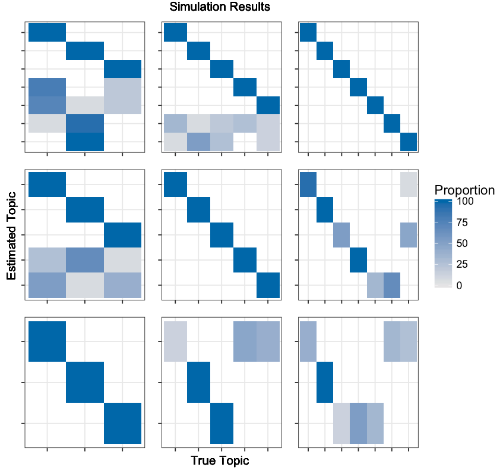
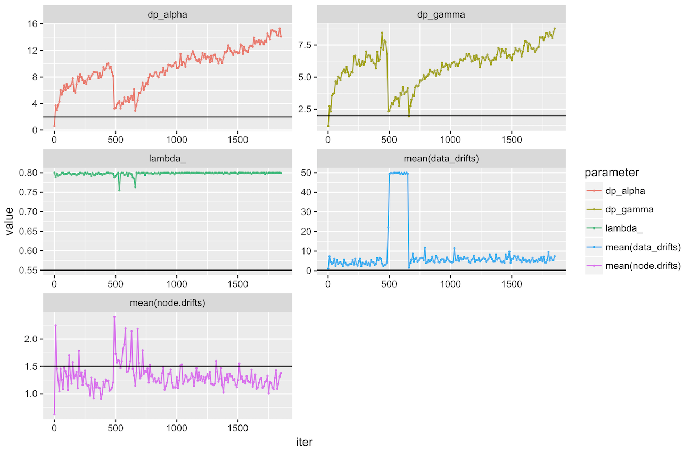
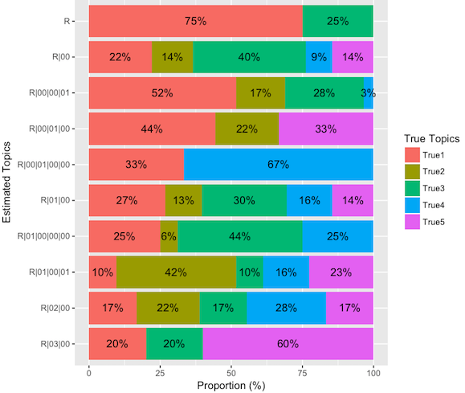
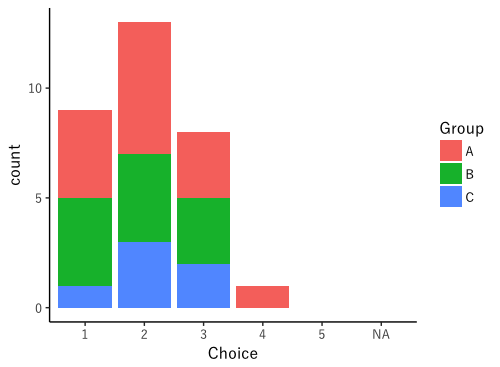
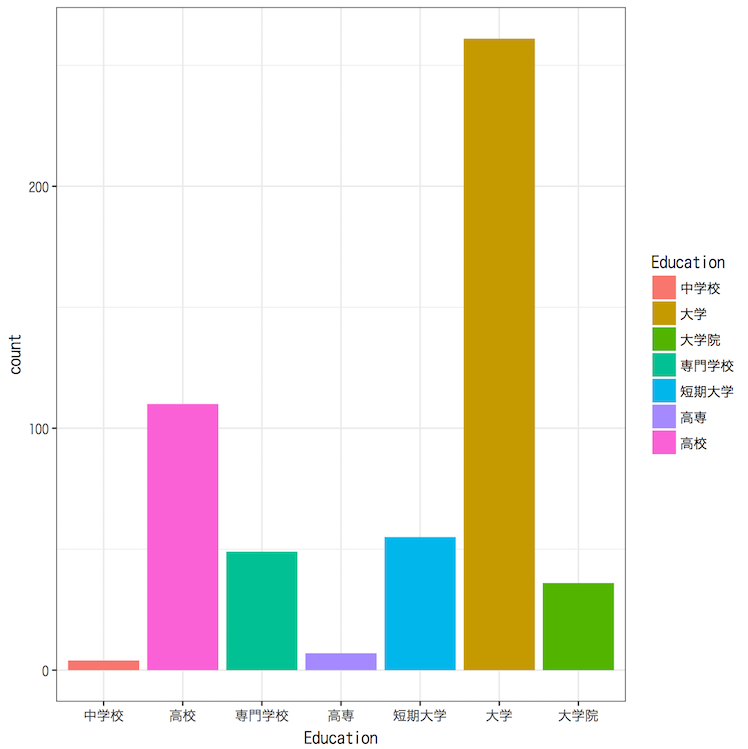
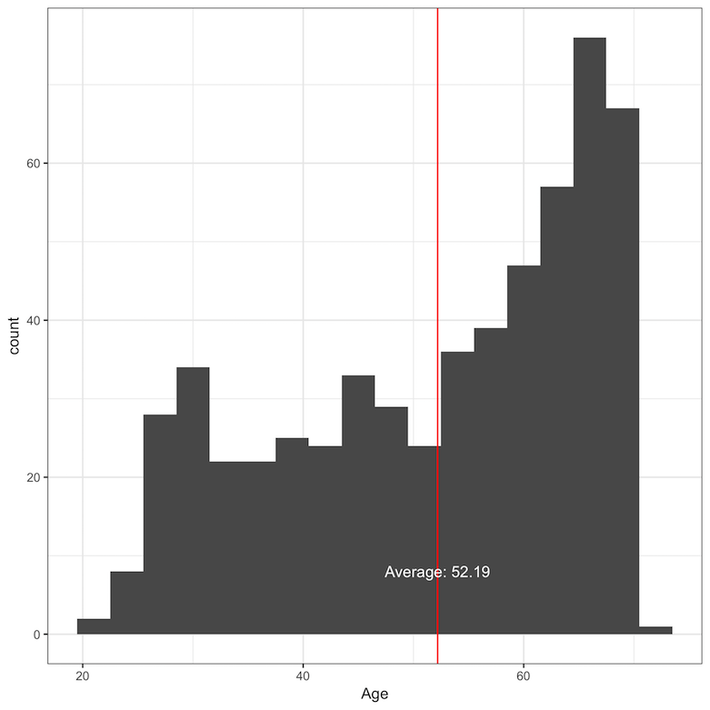
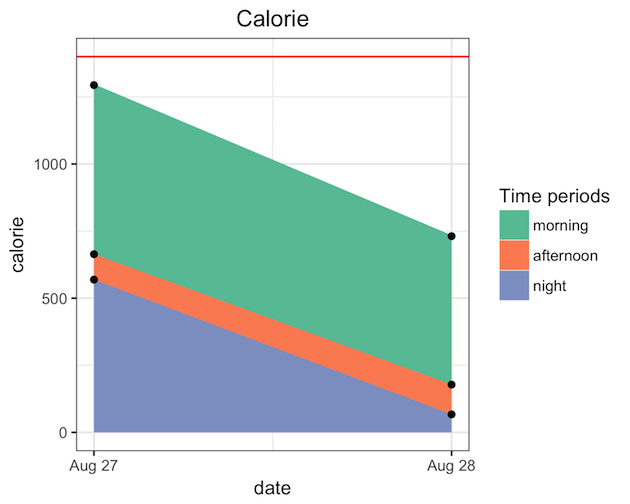
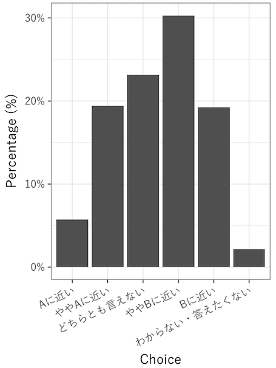
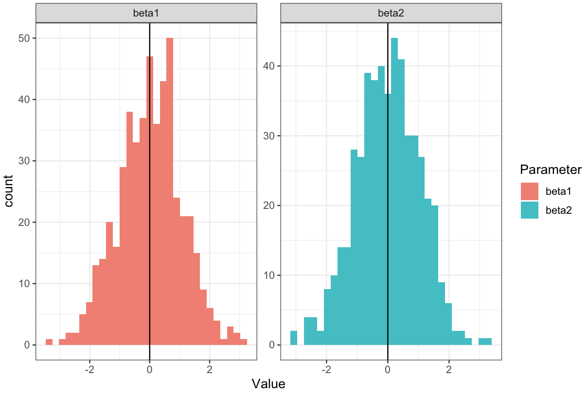
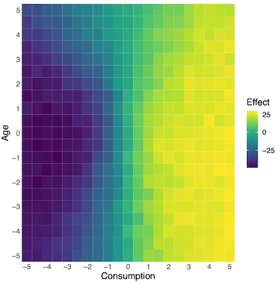

# ggplot2
References:
* [ggplot2 — きれいなグラフを簡単に合理的に](https://heavywatal.github.io/rstats/ggplot2.html)
* [Top 50 ggplot2 Visualizations](http://r-statistics.co/Top50-Ggplot2-Visualizations-MasterList-R-Code.html): 大体何でも載っているサイト
* [ggplot extensions](https://exts.ggplot2.tidyverse.org/gallery/)

* Color code
  * [Bootswatch](https://bootswatch.com/)
  * [MetBrewer](https://github.com/BlakeRMills/MetBrewer)
  * [Nippon Colors](https://nipponcolors.com/)


```r
my_theme <- function(
  legend.position = "right", 
  legend.direction = "vertical",
  legend.key.width = unit(2, "line"),
  textsize = 14) 
{
  p <- theme_bw() +
        theme(plot.title = element_text(hjust = 0.5),
              panel.grid = element_blank(),
              text = element_text(size = textsize),
              legend.position = legend.position,
              legend.direction = legend.direction,
              legend.key.width = legend.key.width)
}
	    
library(ggtheme)
theme_minimal()
```

## Table of Contents
1. [xラベルの変更](#xラベルの変更)
2. [エラーバーの追加](#エラーバーの追加)
3. [線の種類](#線の種類)
4. [図を並べる](#図を並べる)
5. [データの確認](#データの確認)
6. [histogramと確率密度関数を同時に描く](#histogramと確率密度関数を同時に描く)
7. [関数の曲線を描く](#関数の曲線を描く)
8. [タイトルの位置調整](#タイトルの位置調整)
9. [文字列でaesを使う](#文字列でaesを使う)
10. [軸関連](#軸関連)
	* [軸のorderを変える](#軸のorderを変える)
	* [orderとlabelを変える](#orderとlabelを変える)
	* [値で並び替え](#値で並び替え)
	* [カテゴリカルで並び替え](#カテゴリカルで並び替え)
	* [数値を綺麗に](#数値を綺麗に)
	* [Scientific notation](#scientific-notation)
11. [Legend関連](#legend関連)
	* [順番を逆にする](#順番を逆にする)
	* [ラベルを変える](#ラベルを変える)
	* [Legendに表示しない](#legendに表示しない)
	* [Manually add](#manually-add)
	* [Change the length of the legend](#change-the-length-of-the-legend)
12. [theme関連](#theme関連)
	* [一括でサイズ](#一括でサイズ)
	* [細かくサイズ](#細かくサイズ)
13. [position関連](#position関連)
	* [線分の位置](#線分の位置)
14. [Theme](#theme)
15. [日本語関連](#日本語関連)
16. [文字の追加](#文字の追加)
	* [geom_text()](#geom_text)
17. [選択肢を強制的に表示](#選択肢を強制的に表示)
18. [Use environment variables](#use-environment-variables)
19. [色の変更](#色の変更)
20. [積み上げグラフ](#積み上げグラフ)
21. [Correlation Plot](#correlation-plot)
22. [Bar plot with percentage](#bar-plot-with-percentage)
23. [Return ggplot2 object in loop](#return-ggplot2-object-in-loop)
24. [facetで表示を分ける](#facetで表示を分ける)
	* [ラベルの変更](#ラベルの変更)
26. [Colour and Style](#colour-and-style)
27. [if else](#if-else)
28. [Plot 3D info](#plot-3d-info)
	* [geom_tile](#geom_tile)


## xラベルの変更
```r
xlabels <- rep("", 120)
xlabels[c(seq(from = 1, to = 120, by = 10))] <- c(seq(from = 120, to = 1, by = -10))

g <- ggplot(data.frame(predicted=predicted, Date=date_vec, true_index=true_index), aes(x=reorder(Date, true_index), y=predicted)) + 
        geom_point() + xlab("Days to Election") + ylab("Prediction") +
        scale_x_discrete(labels = xlabels) +  # ここで変更を行なっている！
        theme_bw() 
options(repr.plot.width=6, repr.plot.height=2.8)
g
```


## エラーバーの追加
#### その1
データ
```r
> res_mean <- apply(result_df, 2, mean)
> res_025 <- apply(result_df, 2, quantile, prob=.025)
> res_975 <- apply(result_df, 2, quantile, prob=.975)
> result <- data.frame(mean=res_mean, top=res_975, bottom=res_025)
> result$Date <- 1:120
> print(head(result))
       mean    top bottom Date
X1 341.3333 359.65 313.10    1
X2 350.3333 366.00 337.50    2
X3 343.3333 349.50 340.00    3
X4 366.3333 372.75 358.50    4
X5 341.3333 352.25 333.25    5
X6 347.6667 350.85 344.20    6
```
コード
```r
true_index <- 120:1  # 軸ラベルの調整用 (これをしないと、0スタートにソートされてしまう)

xlabels <- rep("", 120) # 適度に間隔の開いたラベルを作る
xlabels[c(seq(from = 1, to = 120, by = 10))] <- c(seq(from = 120, to = 1, by = -10))

g <- ggplot(result, aes(x=reorder(Date, true_index), y=mean, group=1)) + # reorderで指定した順序にする
        geom_line(size=0.8, color="blue") + xlab("Days to Election") + ylab("Prediction") +
        geom_errorbar(size=0.2, aes(ymin=bottom, ymax=top)) +
        geom_point(size=0.9, aes(x=reorder(Date, true_index), y=mean)) + # meanだけはpointを付ける
        geom_line(aes(x=reorder(Date, true_index), y=top), size=0.4, color="gray") + # 上を結ぶ
        geom_line(aes(x=reorder(Date, true_index), y=bottom), size=0.4, color="gray") + # 下を結ぶ
        scale_x_discrete(labels = xlabels) + # 軸ラベルを調整
        theme_bw() 
options(repr.plot.width=7, repr.plot.height=2.8)
g
```


## 線の種類
```r
g <- ggplot(res1, aes(x=EnrollmentCount, y=ClassSize)) +
  geom_line(aes(colour = type, linetype=type), size = 0.87)
```

Manualで変える ([Reference](http://www.sthda.com/english/wiki/ggplot2-line-types-how-to-change-line-types-of-a-graph-in-r-software))
```r
# Set line types manually
g <- ggplot(df2, aes(x=grade, y=score, group=gender)) +
  geom_line(aes(linetype=gender))+
  geom_point()+
  scale_linetype_manual(values=c("dotdash", "dotted"))+
  theme(legend.position="top")
  
# Change line colors and sizes
g <- ggplot(df2, aes(x=grade, y=score, group=gender)) +
  geom_line(aes(linetype=gender, color=gender, size=gender))+
  geom_point()+
  scale_linetype_manual(values=c("solid", "dotted"))+
  scale_color_manual(values=c('#999999','#E69F00'))+
  scale_size_manual(values=c(1, 1.5))+
  theme(legend.position="top")
```

## 図を並べる

### Use patchwork
Probably [the easiest](https://qiita.com/nozma/items/4512623bea296ccb74ba)?

### Use gridExtra

If you do not have to preview, use `arrangeGrob` instead of `grid.arrange`.

Example 1:<br>
[Reference](http://notchained.hatenablog.com/entry/2015/12/17/010904)
```r
library(gridExtra)

g1 <- ggplotGrob(p1)
id.legend <- grep("guide", g1$layout$name)
legend <- g1[["grobs"]][[id.legend]]
lwidth <- sum(legend$width)

# `arrangeGrob` does not show preview
gA <- grid.arrange(p1 + theme(legend.position="none"), 
          p2 + theme(legend.position="none"), 
          legend, 
          layout_matrix = rbind(c(1,1,1,2,2,2,3))
          )
```


Example 2:<br>
```r
grid.arrange(grobs=list(g+ theme(legend.position="none"),
                        g+ theme(legend.position="none")), ncol=2)
```


Example 3:<br>
```r
# Create Combinations
combinations <- expand.grid(trueK, estimatedK) %>%
                  arrange(rev(Var2)) # reorder
num_combinations <- nrow(combinations)

# Load Data
figures <- list()
for(s in 1:num_combinations){
  trueK_ <- combinations[s, 1]
  estimatedK_ <- combinations[s, 2]

  figures[[s]] <- readRDS(file = paste0("../obj/", 
                          "fig_T", trueK_, "_E", estimatedK_, ".obj"))
}

### Create Figure
# Get Information
g1 <- ggplotGrob(figures[[1]])
id.legend <- grep("guide", g1$layout$name)
legend <- g1[["grobs"]][[id.legend]]

# Edit Figure
edit_figure <- theme(legend.position="none",
                     axis.title.x=element_blank(),
                     axis.title.y=element_blank(),
                     axis.text.x=element_blank(),
                     axis.text.y=element_blank())
figures <- lapply(figures, function(x){x + edit_figure})

# New Pictures cf. https://stackoverflow.com/a/11093069/4357279
g <- arrangeGrob(grobs=figures, 
             nrow = length(estimatedK),
             right = legend,
             top = grid::textGrob(title_),
             left = grid::textGrob("Estimated Topic", rot = 90, vjust = 1, gp = grid::gpar(fontsize = 14)),
             bottom = grid::textGrob("True Topic", vjust = -0.1, gp = grid::gpar(fontsize = 14)))

grid.newpage()
grid.draw(g) # Show plot
```


### Use facet
Wrap function is [here](https://github.com/Shusei-E/Code_Tips/blob/master/R/Examples/others/facet_params.R).
```r
> parameters
# A tibble: 186 x 6
    dp_alpha   lambda_ dp_gamma `mean(node.drifts)` `mean(data_drifts)`  iter
       <dbl>     <dbl>    <dbl>               <dbl>               <dbl> <int>
 1 0.6149465 0.8000000 1.186484           0.6222507            1.025149     1
 2 3.7064269 0.7886008 2.734082           2.2459909            7.378842    11
 3 2.9995301 0.7980033 2.314043           1.4600977            4.435327    21

> parameters <- tidyr::gather(parameters, key=parameter, value=value, "dp_alpha","lambda_", "dp_gamma", "mean(node.drifts)", "mean(data_drifts)")
(> parameters <- tidyr::gather(parameters, key=parameter, value=value, -iter) )
> parameters
# A tibble: 930 x 3
    iter parameter     value
   <int>     <chr>     <dbl>
 1     1  dp_alpha 0.6149465
 2    11  dp_alpha 3.7064269
 3    21  dp_alpha 2.9995301

> true <- data.frame(
   parameter = c("dp_alpha","lambda_", "dp_gamma", "mean(node.drifts)", "mean(data_drifts)"),
   value = c(2.0, 0.55, 2.0, 1.5, 0.25)
   )
> head(true, 3)
          parameter value
1          dp_alpha  2.00
2           lambda_  0.55
3          dp_gamma  2.00

> ggplot(data=parameters, aes(x=iter, y=value, group=parameter, color=parameter)) +
     geom_line() +
     geom_point(size=0.3) +
     facet_wrap(~parameter, ncol=2, scales = "free") +
     geom_hline(data = true, aes(yintercept = value))
```


## データの確認
`GGally`の`ggpairs`を使うと良いかも。カスタマイズ方法は「StanとR」のp.55に対応するコードを参照のこと。


## histogramと確率密度関数を同時に描く
[Reference](http://qiita.com/hoxo_b/items/13d034ab0ed60b4dca88)

y-axsis is density:
```r
dens <- density(faithful$waiting)
bw <- diff(range(faithful$waiting))/20

ggplot(faithful, aes(x=waiting)) +
  geom_histogram(aes(y=..density..), binwidth=bw, fill='white', color='black') +
  geom_density(fill='black', alpha=0.3) +
  xlim(range(dens$x))
```

y-axis is count:
```r
dens <- density(faithful$waiting)
bw <- diff(range(faithful$waiting))/20

ggplot(faithful, aes(x=waiting)) +
  geom_histogram(binwidth=bw, fill='white', color='black') +
  geom_density(eval(bquote(aes(y=..count..*.(bw)))), fill='black', alpha=0.3)+
  xlim(range(dens$x))
```


## 関数の曲線を描く
[Reference](http://qiita.com/hoxo_b/items/a6522a6e6561f8ca7b96)  
`stat_function` or `geom_path`


## タイトルの位置調整
Add `theme(plot.title = element_text(hjust = 0.5))` last does centering.

## 文字列でaesを使う
```r
var = 'a'
ggplot(data=d, aes_string(x=var))
```

## 軸関連
### 軸のorderを変える
```r
scale_x_discrete(limits = c('a3', 'a2', 'a1'))
```
が一番簡単そう。
これだと実際のラベルの順番が変わってしまう可能性がある。

Use this instead:
```r
aes(x=reorder(col_name, desc(col_name))
```

細かく指定する場合は、先に`factor`を使うのが早い
```r
data$Party <- factor(data$Party, levels=party_order)
```

### orderとlabelを変える
```r
p + scale_x_discrete(limits = c("I1", "SI2", "SI1"), # order
                     labels = c("Ione","SItwo","SIone")) # new label
```
`coord_flip()`をするときは、逆順で書かないといけないので注意
これで順番問題は解消されるはず。
```r
aes(x = reorder(the_factor, desc(the_factor)), ...)
```

If you do not want to type one by one, consider one of these:
```r
scale_x_discrete(limits = rev(levels(dat$Sektion)))
scale_x_discrete(limits = rev(sort(unique(res$Estimated))))
scale_y_continuous(trans = "reverse", breaks = unique(df$position))
```

If none of above does not work, set manually ([reference](https://qiita.com/hoxo_b/items/c569da6dbf568032e04a)).
Complete example is [here](https://github.com/Shusei-E/Code_Tips/blob/master/R/Examples/others/stack_bar.Rmd).



```r
# Get Color Code
ggColorHue <- function(n, l=65) {
  hues <- seq(15, 375, length=n+1)
  hcl(h=hues, l=l, c=100)[1:n]
}

cols       <- ggColorHue(n=5)
cols_dark  <- ggColorHue(n=5, l=45)
cols_light <- ggColorHue(n=5, l=85)

col2rgb(cols)
scales::show_col(cols)

g1 <- ggplot(res_viz, aes(x=TrueTopics, True, 
                          fill=factor(True, levels=rev(sort(unique(res_viz$True))))
             ))+
      geom_bar(aes(y=..count../sum(..count..)*100)) +
      coord_flip() +
      guides(fill = guide_legend(reverse = TRUE)) +
      scale_fill_manual(name = "True Topics",
                        values=rev(c("#F8766D", "#A3A500", "#00BF7D", "#00B0F6", "#E76BF3"))) +
      xlab("") + ylab("Proportion (%)") + theme_bw(base_size=15)
```

### 値で並び替え
Continuous:
```r
g <- ggplot(res, aes(reorder(Word, Proportion), Proportion, fill = factor(.topic))) +
  geom_col(show.legend = FALSE) + facet_wrap(~ .topic, scales = "free") +
  coord_flip()
```
Here, we reorder `Word` column based on the values of `Proportion` column. If you put `-` before the `Proportion`, you can reverse the order.

### カテゴリカルで並び替え
```r
aes(x = reorder(the_factor, desc(the_factor)), ...)
````

### 数値を綺麗に
```r
scale_y_continuous(breaks = scales::pretty_breaks())
scale_y_continuous(labels = scales::percent)
```


## Scientific notation
```r
scale_science <- function(x) {
  format(x, scientific = TRUE, digit = 2)
}

scale_x_continuous(trans = "log", labels = scale_science)
```


## Legend関連
### 順番を逆にする
```r
guides(fill = guide_legend(reverse = TRUE)) # factor with `aes(fill = )`
guides(colour = guide_legend(reverse = TRUE)) # factor with `aes(colour = )`
```
### ラベルを変える
```r
data %>% select_("Group", "Finished") %>% slice(3:n()) %>% 
   ggplot(aes(Group, fill=Finished)) + geom_bar() + scale_fill_hue(name = "Finished", labels = c("0"="Not Finished", "1"="Finished")) 
```
`aes`のところが`colour`なら、`scale_colour_hue`になる。<br>


### Legendに表示しない
Add `show.legend = F`
```r
geom_point(color="black", position="stack", show.legend = F)
```

### Manually add
```r
ggplot() +
   geom_pointrange(data=values_qua_past,
                   aes(x=X, y=p50, ymin=p5, ymax=p95, colour="Estimated"),
                   size=0.42, show.legend = F) +
   geom_line(data=values_qua_past, aes(x=X, y=p50, colour="Estimated")) +
   geom_point(data=data, aes(x=year, y=DemVotesPct, colour="Truth"),
              size=2.2, shape=17, show.legend = F) + 
   geom_line(data=data, aes(x=year, y=DemVotesPct, colour="Truth"), linetype="longdash") + 
   scale_y_continuous(labels=scales::percent_format()) +
   xlab("House") + ylab("Predicted Percentage") + 
   ggtitle("Democrat's Vote Share in Predicted Elections") +
   theme_bw() + 
   scale_colour_manual(name="",values=c(Estimated="black", Truth="blue")) +
   theme(plot.title = element_text(hjust = 0.5))
```


### Change the length of the legend
```r
theme(legend.key.width = unit(2, "line"))
```

## theme関連
### 一括でサイズ
```r
theme_gray(base_size=12)
theme_bw(base_size=12)
```

### 細かくサイズ
```r
theme(legend.position="none", text = element_text(size=15))
```

## position関連
### 線分の位置
[ここ](https://github.com/Shusei-E/Code_Tips/blob/master/R/dplyr.md#regression-simulation)にも書いた通り、`position_dodge`を負の値にすることで線分の並びを逆にすることができる ([Reference](http://stackoverflow.com/questions/42303960/ggplot2-change-the-order-of-color))。
<br>

Coefficient plotを作るだけなら、[sjPlot](https://strengejacke.github.io/sjPlot/articles/plot_model_estimates.html)も参考に。

```r
# Toy Data and Make a Figure
interval1 <- -qnorm((1-0.9)/2)  # 90% multiplier
interval2 <- -qnorm((1-0.95)/2)  # 95% multiplier
population_num <- 100
tibble(
    gender = as.numeric(rbinom(population_num, 1, 0.5)),
    age=rnorm(population_num, mean=50, sd=20),
    score=rnorm(population_num, mean=80, sd=30),
    setid=sample(c(1,2,3), size=population_num, replace=T)
    ) %>%
  group_by(setid) %>%
  do(model1 = tidy(lm(score ~ age, data = .)),
     model2 = tidy(lm(score ~ age + gender, data = .))) %>% 
  gather(model_name, model, -setid) %>%                     
  unnest() %>%                                              
  filter(term == "age")  %>%                                 
ggplot(aes(colour = as.factor(setid))) +
  geom_hline(yintercept = 0, colour = gray(1/2), lty = 2) +
  geom_linerange(aes(x = model_name, ymin = estimate - std.error*interval1,
                     ymax = estimate + std.error*interval1),
                 lwd = 1, position = position_dodge(width = -1/2)) +
  geom_pointrange(aes(x = model_name, y = estimate, 
											ymin = estimate - std.error*interval2,
											ymax = estimate + std.error*interval2),
									lwd = 1/2, position = position_dodge(width = -1/2),
									shape = 21, fill = "WHITE") +
  scale_x_discrete(limits=c("model2", "model1"), labels=c("M2", "M1")) +
  scale_colour_hue(name = "Model", 
					labels = c("1"="Model 1", "2"="Model 2", "3"="Model 3")) +
  coord_flip()
```
図の[Reference](https://gist.github.com/Shusei-E/48c2cc1c36899cd6615480a8fbcf5cc5)。

## Theme
[ggthemes](https://www.karada-good.net/analyticsr/r-566)

### font
```
theme(plot.title = element_text(hjust = 0.5),
      text = element_text(size=16))
```


## 日本語関連
```r
p <- p + theme_gray(base_family="YuGo-Medium")
```
のような使い方になる。もしくは、ファイルの先頭で
```
quartzFonts(HiraKaku = quartzFont(rep('Hiragino Kaku Gothic Pro W3', 4)))
theme_set(theme_gray(base_size = 12, base_family = 'HiraKaku'))
```

ただし、ggsaveの場合は使えるフォントが限られる。
```r
ggsave(filepath, p, family="Japan1GothicBBB")
```

## 文字の追加
```r
annotate("text", x=5, y=8, colour="red",
   label=paste("Average:", as.character(round(mean_v,2))))
```

### geom_text()
文字が被らないようにしたかったら、`ggrepel` packageを使う。
これでもOK
```r
geom_text(aes(label = PointVal), position = position_nudge(x = 0.26))
```

## 選択肢を強制的に表示
```r
data %>% select_("Q1.5", "Group") %>%
  ggplot(aes(factor(Q1.5), fill=factor(Group))) + geom_bar() +
  scale_fill_hue(name = "Group") + labs(x="Choice") +
  scale_x_discrete(limits=c(1,2,3,4,5,"NA"))
```


## Use environment variables
```r
.e <- environment()
    ggplot(Data, aes(x = x, y = y*YMul), environment = .e) + geom_line()
```

Let's use this and make a function to draw a bar plot.
```r
fig_BarPlot <- function(data, qnum, varname, savename, mylimits=NA, mylabels=NA, folder="figures/"){

  temp <- data %>% select_(get("qnum")) 
  .e <- environment()

  p <- ggplot(temp, aes(x=temp[[get("qnum")]], fill=temp[[get("qnum")]]), environment = .e) + 
  geom_bar(stat="count") 

  # Modify order and labels
  if (is.na(mylimits) & is.na(mylabels)){
    # Nothing to do
  } else if(is.vector(mylimits) & is.vector(mylabels) & !is.na(mylimits) & !is.na(mylabels)){
    p <- p + scale_x_discrete(limits=mylimits, labels=mylabels) 
  } else if(is.vector(mylimits) & is.na(mylabels)){
    p <- p + scale_x_discrete(limits=mylimits) 
  } else if(is.na(mylimits) & is.vector(mylabels)){
    p <- p + scale_x_discrete(labels=mylabels) 
  }


  p <- p + scale_fill_hue(name = varname) + labs(x=varname)

  savehist <- paste(folder, savename, sep="")
  ggsave(savehist, p)
  
}

fig_BarPlot(data, "Q15.7", "Education",
       mylimits=c("中学校", "高校", "専門学校", "高専",
                   "短期大学", "大学", "大学院"),
       savename = "education.pdf")

```


Another Example:
```r
myggsave <- function(savepath, p, font_family="Japan1GothicBBB", save=T, themebw=T, legend=F, return_=F){
  if(themebw)
    p <- p + theme_bw() 
  
  if(!legend)
    p <- p + theme(legend.position="none")

  if(save)
    ggsave(savepath, p, family=font_family)

  if(return_)
    return(p)
}

fig_hist <- function(data, qnum, varname, savename, bin=25, folder="figures/"){  
  # Hist
  mean_v <- mean(unlist(data[, qnum]))
  temp <- data
  .e <- environment()
  p <- ggplot(temp, aes(x=temp[[get("qnum")]], , fill=temp[[get("qnum")]])) + 
    geom_histogram(binwidth=bin) +
    labs(x=varname) + 
    geom_vline(xintercept=mean_v, colour="red") +
    annotate("text", x=mean_v, y=8, colour="white",
            label=paste("Average:", as.character(round(mean_v,2)))) 

  savehist <- paste(folder, savename, sep="")
  myggsave(savehist, p)
}

data %>% mutate(Q15.5_real = 2017 - Q15.5) %>%
  fig_hist(., "Q15.5_real", "Age", "age.pdf", bin=3)
```


## 色の変更
[Color Palettes](http://rstudio-pubs-static.s3.amazonaws.com/5312_98fc1aba2d5740dd849a5ab797cc2c8d.html)
```r
scale_fill_brewer(palette="Spectral")
scale_fill_manual(values=c("#09aa04", "#990066"))
```

### 点や線の色
[Reference](https://qiita.com/yutannihilation/items/b4130186e1e095719dcb)

If the variables' names are colour:
```r
d <- data.frame(x = 1:4, y = 1:4,
                colour = c("red", "green", "blue", "yellow"))
		
ggplot(d, aes(x, y, colour = colour)) +
    geom_point() +
    scale_colour_identity(guide = "legend")  # explicitly shows legend (remove it if you don't need it)
```

If you want to specify the colour:
```r
d <- data.frame(x = 1:4, y = 1:4,
                colour = c("col1", "col2", "col3", "col4"))

ggplot(d, aes(x, y, colour = colour)) +
  geom_point(size = 15) +
  scale_colour_manual(
    values = c(
      col1  = "tomato",
      col2  = "darkgreen",
      col3  = "blue3",
      col4  = "yellow3"
    )
  )
```

## 積み上げグラフ
### 折れ線
```r
> calorie_timeperiod
# A tibble: 6 x 3
        date time_period calorie
      <date>       <chr>   <dbl>
1 2017-08-27   afternoon    95.0
2 2017-08-27     morning   630.0
3 2017-08-27       night   569.0
4 2017-08-28   afternoon   111.0
5 2017-08-28     morning   553.2
6 2017-08-28       night    66.9

> calorie_timeperiod_fig <- ggplot(calorie_timeperiod, 
  aes(x=date, y=calorie,
      group=factor(time_period, levels=c("morning","afternoon", "night", "midnight")),
      fill=factor(time_period, levels=c("morning","afternoon", "night", "midnight")),
      color=factor(time_period, levels=c("morning","afternoon", "night", "midnight")))) +
  geom_line(position="stack") + 
  geom_area(aes(color=NULL),position="stack") + # use only group and fill
  geom_hline(aes(fill=NULL), yintercept = 1400, color="red") + # Ideal calorie (actually, 1300) 
  geom_point(color="black", position="stack", show.legend = F) + # don't show point in legend
  ggtitle("Calorie") +
  guides(fill=guide_legend(title="Time periods"), color=guide_legend(title="Time periods")) +
  scale_color_brewer(palette="Set2") +
  scale_fill_brewer(palette="Set2") +
  theme_bw() +
  theme(plot.title = element_text(hjust = 0.5))
```


## Correlation Plot
```r
library(ggcorrplot)
data %>%
  select(starts_with("Q6.")) %>%
  mutate(ID = 1:n()) %>%
  gather(key=question, value=answer, -ID) %>%
  na.omit() %>%
  rowwise() %>%
  mutate(marked=mark_sec6(question, answer)) %>%
  mutate(qsec = substr(question, 1, 4)) %>%
  ungroup() %>%
  group_by(ID, qsec) %>%
  summarize(sec_total = sum(marked)) %>%
  ungroup() %>%
  spread(key=qsec, value=sec_total) %>%
  select(-ID) %>%
  cor() %>%
  ggcorrplot(., type="lower", lab = TRUE)
```

## Bar plot with percentage
```r
ggplot(temp, aes(x=Choice)) +
  geom_bar(aes(y = (..count..)/sum(..count..))) +
  scale_x_discrete(limits=choices) +
  scale_y_continuous(labels=scales::percent) +
  ylab("Percentage (%)") +
  theme_bw(base_family = "YuGo-Medium", base_size=16) +
  theme(axis.text.x = element_text(angle = 25, hjust = 1))
```


## Return ggplot2 object in loop
```r
fig <- function(lower, upper){
    g <-list( 
      geom_vline(xintercept=lower, lty=2, size=0.3),
      geom_vline(xintercept=upper, lty=2, size=0.2)
    )
    return(g)
}

g <- ggplot() 
lower_seq <- seq(0.45,0.4975,0.0025)
upper_seq <- seq(0.55, 0.5025, -0.0025)
for(i in 1:length(lower_seq)){
  g <- g + fig(lower_seq[i], upper_seq[i])
}
```

Store in list:
```r
lambda_figs <- list()
count <- 1
for(i in 1:dim1){
  for(m in 1:dim2){
    g <- visualize_lambda_draw(true_Lambda, res_Lambda, i, m)
    lambda_figs[[count]] <- g
    count <- count + 1
  }
}
```
Do not use `l <- c(l, obj)`.


## facetで表示を分ける
```r
library(mvtnorm)
beta <- rmvnorm(1000, mean=rep(0, nrow(sigma)), sigma=diag(1, D))
tibble(beta1 = beta[, 1],
       beta2 = beta[, 2]) %>%
  slice(floor(n()/2):n()) %>%
  gather(key=Parameter, value=Value) %>%
  ggplot(., aes(x=Value, fill=Parameter)) +
    geom_histogram() +
    geom_vline(data=tibble(Truth=c(0, 0),  # Truth
                           Parameter=c("beta1", "beta2")),
               aes(xintercept=Truth, group=Parameter)) +
    facet_wrap(~Parameter, ncol=2, scales = "free") +
    my_theme
```


If you want to change the width, use `facet_grid(~Group, scale = "free_x", space = "free")`.

### Change size
Use the `force_panelsizes()` function in `ggh4x`([reference](https://stackoverflow.com/a/65836587/4357279))


### ラベルの変更
```r
facet_wrap(
  ~feature, scale = scale, nrow = nrow,
  labeller = labeller(feature = ~{str_remove_all(., "\`")})
)
```
Removing backticks from `feature`.


## Colour and Style

### Colour
* [ggsci: Color Palettes for ggplot2](https://github.com/road2stat/ggsci)
* [Colour generator](https://www.colorhexa.com/)
* [paletteer](https://github.com/EmilHvitfeldt/paletteer)
* [Viridis color](https://gotellilab.github.io/GotelliLabMeetingHacks/NickGotelli/ViridisColorPalette.html)

### Style
* [BBC Style](https://bbc.github.io/rcookbook/)


## if else
```r
fig_base(res, yintercept, x_category = x_category) +
  {if (facet) facet_wrap(~Category)} +
  xlab(xlab) + ylab(ylab) +
  {if (!is.null(set_ylim)) ylim(set_ylim)} +
  {if (coord_flip) coord_flip()} +
  fig_theme
```


## Plot 3D info
### geom_tile
```r
p <- ggplot(res %>% mutate(L2 = factor(L2), L3 = factor(L3)), 
            aes(x = L2, y = L3)) +
  geom_tile(aes(fill = TestPerplexity, colour = NumTopics), size = 1.5,
            width = 0.95, height = 0.9,  # make spaces between tiles
            linejoin = "bevel") +
  scale_fill_gradient(low = "blue", high = "white") +
  scale_colour_gradient(low = "red", high = "gray60")
```

Changing colors:
```r
scale_fill_gradientn(colours = viridis::viridis(10))
```

### Example
```r
grid %>%
  mutate(Consumption = factor(Consumption), Age = factor(Age)) %>%
ggplot(., aes(x = Consumption, y = Age)) +
  geom_tile(aes(fill = eval)) +
  scale_fill_gradientn(colours = viridis::viridis(10), name = "Effect") +  #  scale_fill_gradient2() also works
  scale_x_discrete(breaks = as.character(c(-5, -4, -3, -2, -1, 0, 1, 2, 3, 4, 5))) +
  scale_y_discrete(breaks = as.character(c(-5, -4, -3, -2, -1, 0, 1, 2, 3, 4, 5))) +
  # theme
  theme_bw() +
  theme(plot.title = element_text(hjust = 0.5),
        panel.grid = element_blank(),
        text = element_text(size = 14),
        panel.border = element_blank(),
        axis.ticks = element_blank(),
        axis.text.x = element_text(margin = unit(c(-2, 0, 0, 0), 'points')),  # make it closer to the panel
        axis.text.y = element_text(margin = unit(c(0, -2, 0, 0), 'points')),
        legend.position = legend.position)
```

