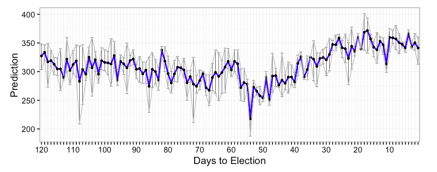
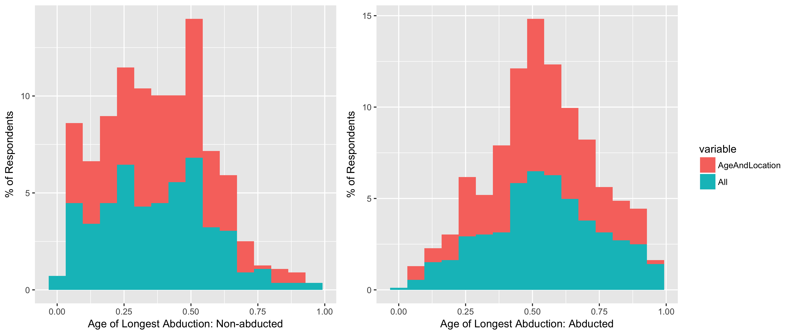

# ggplot2
References:
* [ggplot2 — きれいなグラフを簡単に合理的に](https://heavywatal.github.io/rstats/ggplot2.html)

## Table of Contents
1. [xラベルの変更](#xラベルの変更)
2. [エラーバーの追加](#エラーバーの追加)
3. [線の種類](#線の種類)
4. [図を並べる](#図を並べる)
5. [データの確認](#データの確認)
6. [histogramと確率密度関数を同時に描く](#histogramと確率密度関数を同時に描く)
7. [関数の曲線を描く](#関数の曲線を描く)


## xラベルの変更
```r
xlabels <- rep("", 120)
xlabels[c(seq(from = 1, to = 120, by = 10))] <- c(seq(from = 120, to = 1, by = -10))

g <- ggplot(data.frame(predicted=predicted, Date=date_vec, true_index=true_index), aes(x=reorder(Date, true_index), y=predicted)) + 
        geom_point() + xlab("Days to Election") + ylab("Prediction") +
        scale_x_discrete(labels = xlabels) +  # ここで変更を行なっている！
        theme_bw() 
options(repr.plot.width=6, repr.plot.height=2.8)
g
```


## エラーバーの追加
#### その1
データ
```r
> res_mean <- apply(result_df, 2, mean)
> res_025 <- apply(result_df, 2, quantile, prob=.025)
> res_975 <- apply(result_df, 2, quantile, prob=.975)
> result <- data.frame(mean=res_mean, top=res_975, bottom=res_025)
> result$Date <- 1:120
> print(head(result))
       mean    top bottom Date
X1 341.3333 359.65 313.10    1
X2 350.3333 366.00 337.50    2
X3 343.3333 349.50 340.00    3
X4 366.3333 372.75 358.50    4
X5 341.3333 352.25 333.25    5
X6 347.6667 350.85 344.20    6
```
コード
```r
true_index <- 120:1  # 軸ラベルの調整用 (これをしないと、0スタートにソートされてしまう)

xlabels <- rep("", 120) # 適度に間隔の開いたラベルを作る
xlabels[c(seq(from = 1, to = 120, by = 10))] <- c(seq(from = 120, to = 1, by = -10))

g <- ggplot(result, aes(x=reorder(Date, true_index), y=mean, group=1)) + # reorderで指定した順序にする
        geom_line(size=0.8, color="blue") + xlab("Days to Election") + ylab("Prediction") +
        geom_errorbar(size=0.2, aes(ymin=bottom, ymax=top)) +
        geom_point(size=0.9, aes(x=reorder(Date, true_index), y=mean)) + # meanだけはpointを付ける
        geom_line(aes(x=reorder(Date, true_index), y=top), size=0.4, color="gray") + # 上を結ぶ
        geom_line(aes(x=reorder(Date, true_index), y=bottom), size=0.4, color="gray") + # 下を結ぶ
        scale_x_discrete(labels = xlabels) + # 軸ラベルを調整
        theme_bw() 
options(repr.plot.width=7, repr.plot.height=2.8)
g
```



## 線の種類
```r
g <- ggplot(res1, aes(x=EnrollmentCount, y=ClassSize)) +
  geom_line(aes(colour = type, linetype=type), size = 0.87)
```

Manualで変える ([Reference](http://www.sthda.com/english/wiki/ggplot2-line-types-how-to-change-line-types-of-a-graph-in-r-software))
```r
# Set line types manually
g <- ggplot(df2, aes(x=grade, y=score, group=gender)) +
  geom_line(aes(linetype=gender))+
  geom_point()+
  scale_linetype_manual(values=c("dotdash", "dotted"))+
  theme(legend.position="top")
  
# Change line colors and sizes
g <- ggplot(df2, aes(x=grade, y=score, group=gender)) +
  geom_line(aes(linetype=gender, color=gender, size=gender))+
  geom_point()+
  scale_linetype_manual(values=c("solid", "dotted"))+
  scale_color_manual(values=c('#999999','#E69F00'))+
  scale_size_manual(values=c(1, 1.5))+
  theme(legend.position="top")
```

## 図を並べる
[Reference](http://notchained.hatenablog.com/entry/2015/12/17/010904)
```r
g1 <- ggplotGrob(p1)
id.legend <- grep("guide", g1$layout$name)
legend <- g1[["grobs"]][[id.legend]]
lwidth <- sum(legend$width)

gA <- grid.arrange(p1 + theme(legend.position="none"), 
          p2 + theme(legend.position="none"), 
          legend, 
          layout_matrix = rbind(c(1,1,1,2,2,2,3))
          )
```



## データの確認
`GGally`の`ggpairs`を使うと良いかも。カスタマイズ方法は「StanとR」のp.55に対応するコードを参照のこと。


## histogramと確率密度関数を同時に描く
[Reference](http://qiita.com/hoxo_b/items/13d034ab0ed60b4dca88)

y-axsis is density:
```r
dens <- density(faithful$waiting)
bw <- diff(range(faithful$waiting))/20

ggplot(faithful, aes(x=waiting)) +
  geom_histogram(aes(y=..density..), binwidth=bw, fill='white', color='black') +
  geom_density(fill='black', alpha=0.3) +
  xlim(range(dens$x))
```

y-axis is count:
```r
dens <- density(faithful$waiting)
bw <- diff(range(faithful$waiting))/20

ggplot(faithful, aes(x=waiting)) +
  geom_histogram(binwidth=bw, fill='white', color='black') +
  geom_density(eval(bquote(aes(y=..count..*.(bw)))), fill='black', alpha=0.3)+
  xlim(range(dens$x))
```


## 関数の曲線を描く
[Reference](http://qiita.com/hoxo_b/items/a6522a6e6561f8ca7b96)  
`stat_function` or `geom_path`
